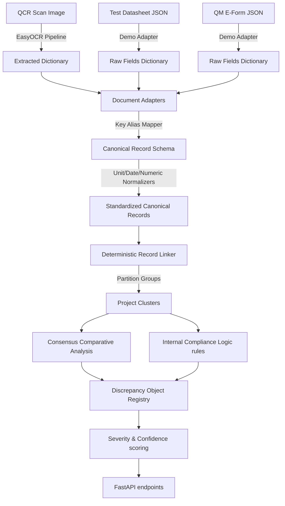

# Cross-Document Discrepancy Detection Engine

The discrepancy engine performs semantic linking, value normalization, and comparative audit checks across quality control reports related to the same road project.

---

## 1. System Architecture Flow

The data flow from raw physical documents to React Dashboard warnings operates as follows:

---

## 2. Technical Component Details

### A. Canonical Data Model (`canonical_schema.py`)
To prevent data loss and ensure traceability, every variable is wrapped in a provenance structure:
* `value`: Standardized value (e.g., Decimal number or ISO date)
* `source_document`: Origin document type (`QCR`, `TEST_DATASHEET`, `QM_EFORM`)
* `source_field`: Original form label (e.g., `road` or `inspection_dt`)
* `ocr_confidence`: Confidence metric propagated from OCR engine

### B. Preprocessing Normalizers
* **Schema Alias Mapper (`schema_normalizer.py`)**: Maps variable synonyms (e.g. `road_name`, `road`, `name_of_road`) to a single schema key.
* **Unit Standardizer (`unit_normalizer.py`)**: Compares values in standard base units (converting `cm` or `m` to `mm` for length; `kg` or `tonne` to `g` for mass).
* **Numeric Parser (`numeric_normalizer.py`)**: Resolves punctuation (like commas for decimals) and extracts decimals using Python's `Decimal` type to avoid floating point comparison rounding problems.
* **Date Normalizer (`date_normalizer.py`)**: Resolves slashes, hyphens, and textual month formats (e.g. `12 Aug 2026`) into ISO format `YYYY-MM-DD`.

### C. Record Linking Heuristics (`record_linker.py`)
Groups documents into project folders based on deterministic scoring metrics:
1. Exact match on `project_code`, `package_id`, or `road_code`.
2. Combination matches on `road_name` (normalized fuzzy) + `district` + `block`.

### D. Consensus Outlier Resolution (`cross_document_checker.py`)
When comparing 3+ documents for a single road project, rather than generating duplicate pairwise warnings, the checker:
1. Resolves values using the type-specific comparators.
2. Group matching records together.
3. Identifies the "consensus" value (highest occurrence count) and reports the "outlier" (mismatch) document.

### E. Scoring Calculators
* **Severity (`severity_calculator.py`)**: Assigns `LOW`, `MEDIUM`, `HIGH`, or `CRITICAL` flags based on field importance, difference percentages, and rule violations.
* **Confidence (`confidence_calculator.py`)**: Calculates discrepancy reliability by combining average OCR scanner accuracy, linking weights, and parsing status.

---

## 3. Limitations & Future Development
* **OCR Automation**: Currently, only QCR images support full automated OCR. Test Datasheets and QM E-Forms rely on structured adapters. Future phases will introduce custom templates for these document styles.
* **Probable Matches**: Fuzzy text checks rely on Sequence Matching. Advanced layouts can be augmented with localized vocabulary dictionaries.
